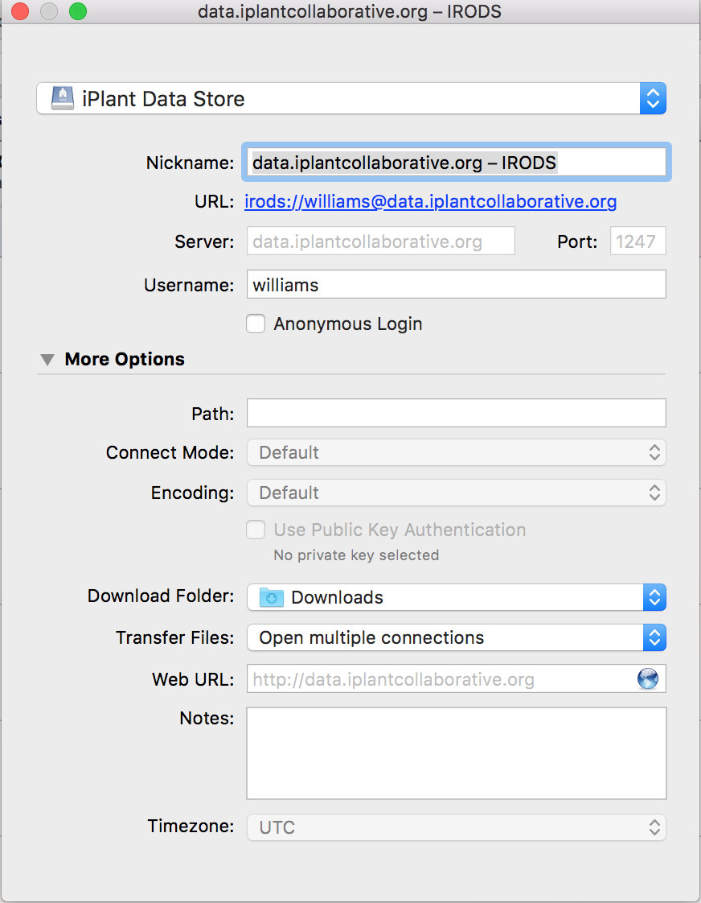
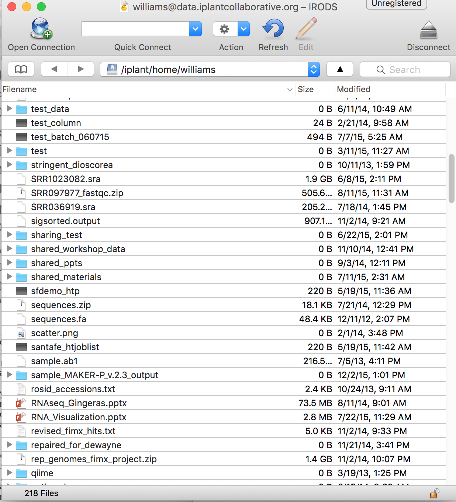

# Uploading importing, and managing data

## Data Overview

The CyVerse Data Store unifies all CyVerse cyberinfrastructure. In practical terms this means that though the interfaces to the Data Store differ (e.g. Cyberduck, iDrop, iCommands, Discovery Environment, APIs, etc.) they are all operating on the same system – giving you the freedom to move between platforms. Here are some solutions for common data management tasks in CyVerse:

### Key Data Store features

- 100 GB allocation per user (you may [request additional storage](http://www.cyverse.org/content/increase-your-data-store-allocation))
- Data are automatically backed up
- Optimal transfer speeds 100GB transfer ~30 min. 
- IRODS grid storage provides powerful data management tools for metadata and sharing

 
### Quick recommendations
|Task|Recommendation|
|----|--------------|
|Upload or Download files (including large files, large numbers of files, and/or folders)|Use the Cyberduck data transfer application (for Windows, Mac)|
|Share Data with other CyVerse users (files or folders) or create Public URLs to specific datasets|Use the Discovery Environment (any web browser)|
|Manage metadata for single files or large collections of files|Use the Discovery Environment (any web browser) or iCommands|
|Write scripts or work in the terminal/shell to manage data|Use iCommands
 
## Uploading and downloading data using Cyberduck

Cyberduck is a user-friendly standalone application that can serve the majority of use cases for the majority of users. Feel free to upload any data you wish to analyze, especially in the context of the workshop. If you don’t have sample data, just upload any document as a test.

### Downloading and configuring Cyberduck

#### Download Cyberduck

1. Go to the Cyberduck installation page at [https://cyberduck.io/](https://cyberduck.io/)
2. Follow the steps for your OS (not available for LINUX users):
    - For Mac OS: Click Download Cyberduck-4.7.1.zip (or later version than 4.7.1).
    - For Windows: Click Download Cyberduck-Installer-4.7.1.exe (or later version than 4.7.1, if displayed).

#### One-time configuration of Cyberduck for use with CyVerse

1. Download the [CyVerse configuration profile](https://pods.iplantcollaborative.org/wiki/download/attachments/18188197/iPlant%20Data%20Store.cyberduckprofile?version=1&modificationDate=1436557522000&api=v2) 
2. Double-click on the downloaded profile, Cyberduck should automatically start.  
3. Verify iPlant Data Store is displayed in the first field.
4. In the Nickname field, enter **data.iplantcollaborative.org – iRODS**
5. Create a connection that uses your CyVerse user account for login (Optionally: you may create an anonymous connection to access public data without an iPlant user account - see full [CyVerse documentation](https://pods.iplantcollaborative.org/wiki/display/DS/Using+Cyberduck+for+Uploading+and+Downloading+to+the+Data+Store)
6. In the populated URL field, verify **irods://data.iplantcollaborative.org** is displayed.
7. In the Server field, enter **data.iplantcollaborative.org.**
8. In the Port field, enter **1247**.
9. In the Username field, enter your CyVerse user name.
10. Verify your username is added to the URL field (e.g.: irods://yourusername@data.iplantcollaborative.org.)
11. In the More Options section, select Open multiple connections in the Transfer Files drop-down list.

**Example completed Cyberduck configuration**

#### Uploading and downloading from the Data Store

In the Cyberduck window, double-click a bookmark.
Log in to Cyberduck using your CyVerse username and password. By default, your Home folder is selected.

##### Upload to Data Store
- Drag the file and folder from your local computer to the desired location in you CyVerse Data Store. 

or 

- Click the Cyberduck File menu and then click Upload and select the file or folder to upload - the item is uploaded to your Home folder

##### Download from Data Store

- Drag the file and folder from your CyVerse Data Store to the desired location on your local computer. 

or 

- Click the file or folder to download and select the Cyberduck File menu and then click Download - the file is downloaded to your default download folder. 

> **Tip:** To navigate to a different folder (for example, to download a file from the Community Data folder)
   1. Click the Cyberduck Go menu and then click Go to Folder. 
   2. Enter the path to the folder (you may want to copy the path to the folder displayed in the DE Data window's Viewing field).For example, to go to the Data Store Shared folder, enter **/iplant/home/shared**; Click **Go**. 

**Cyberduck window connected to Data Store**

        